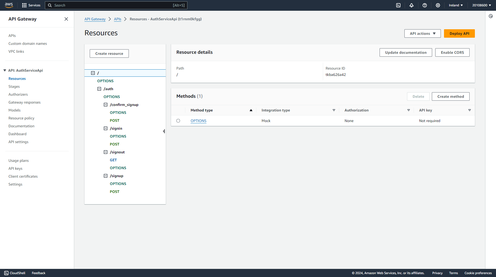
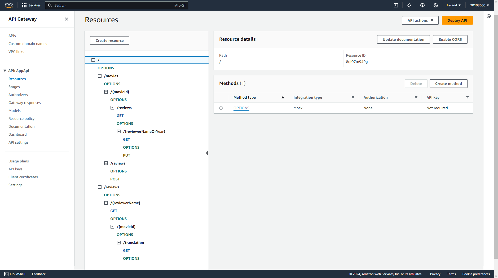
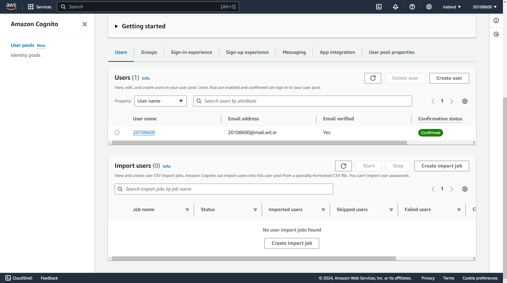
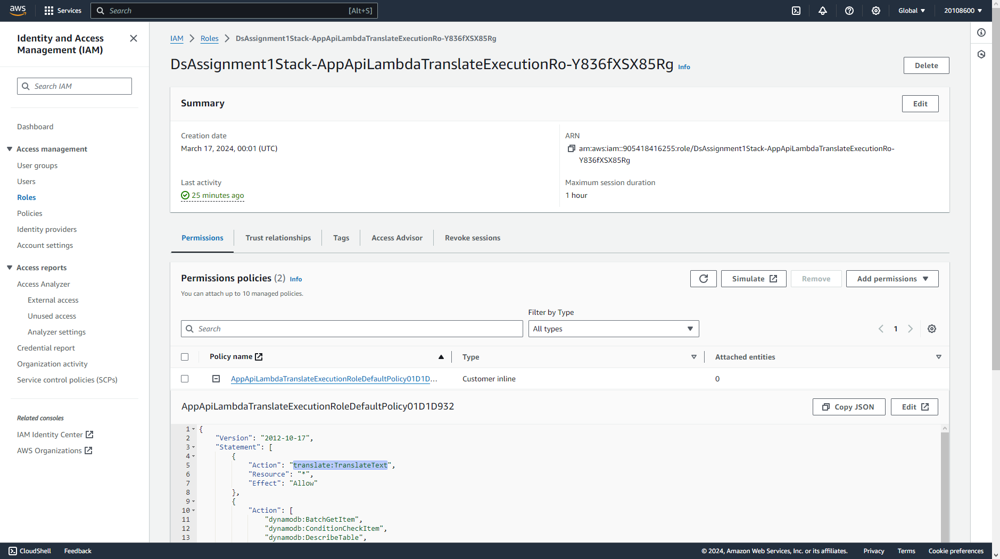

## Serverless REST Assignment.

**Name:** Göktuğ YEŞİLYURT

**Video demonstration:** https://www.youtube.com/watch?v=fWNfRziKgeY

This repository contains an implementation of a serverless REST API for the AWS platform. The CDK framework is used to provision its infrastructure. The API's domain context is movie reviews.

### API endpoints.

-   POST /movies/reviews - add a movie review.
-   GET /movies/{movieId}/reviews - Get all the reviews for the specified movie.
-   GET /movies/{movieId}/reviews?minRating=n - Get the reviews for the specified movie with a rating greater than the minRating.
-   GET /movies/{movieId}/reviews/{reviewerName} - Get the review written by the named reviewer for the specified movie.
-   PUT /movies/{movieId}/reviews/{reviewerName} - Update the text of a review.
-   GET /movies/{movieId}/reviews/{year} - Get the reviews written in a specific year for a specific movie.
-   GET /reviews/{reviewerName} - Get all the reviews written by a specific reviewer.
-   GET /reviews/{reviewerName}/{movieId}/translation?language=code - Get a translated version of a movie review using the movie ID and reviewer name as the identifier.

More details of these endpoints can be found in [EXTENDED_README.md](./EXTENDED_README.md) file.

#### Auth Endpoints on AWS

#### App API Endpoints on AWS

### Authentication.

### Independent learning.

Here is the screenshot of the IAM Role that is used **exclusively** by the `GetTranslatedReviewerReviewOfMovieFn` and generated automatically upon deployment of the stack. This role is necessary because normal execution role does not have permission to use Amazon Translate, so this role is created and then used when executing the translation endpoint to make sure that endpoint can run properly, and no manual interaction with the IAM is required.

